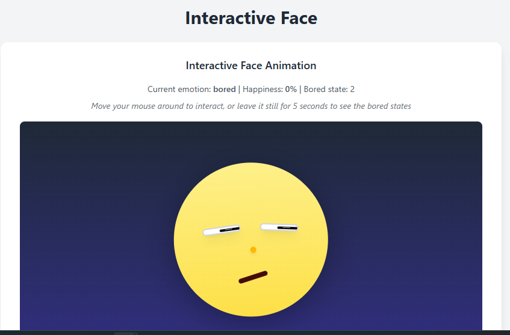

# Interactive face animation Tracker




A playful and interactive face component built with **React** that tracks mouse movement and displays various emotions—**happy**, **surprised**, **bored**, and **neutral**—based on proximity and user interaction.

 <!-- You can replace or remove this line if no demo gif -->

---

## ✨ Features

* 👀 Eyes follow the cursor around the screen.
* 😲 Surprised when you return after a short period of inactivity.
* 🙂 Gets **happier** the closer your mouse is to the face.
* 😐 Returns to **neutral** if interaction reduces.
* 😴 Shows **boredom** after long inactivity.
* 💗 Dynamic facial animations and transitions using CSS + JavaScript.


---

## 📦 Technologies Used

* [React](https://reactjs.org/)
* [Tailwind CSS](https://tailwindcss.com/) for utility-first styling
* HTML5/CSS3
* JavaScript (`useState`, `useEffect`, `useRef`, and DOM APIs)
* ViteJs for bundling
---

## 🚀 Getting Started

### Prerequisites

Ensure you have **Node.js** and **npm** (or **yarn**) installed:

```bash
node -v
npm -v
```

### Installation

1. **Clone the repo**

```bash
git clone https://github.com/your-username/face-emotion-tracker.git
cd face-emotion-tracker
```

2. **Install dependencies**

```bash
npm install
# or
yarn install
```

3. **Run the app**

```bash
npm start
# or
yarn start
```

Visit `http://localhost:5173` in your browser.

---

## 🧠 How It Works

* Mouse movement is tracked via `window.addEventListener('mousemove')`.
* A central reference point on the face is used to calculate proximity.
* **Happiness** increases with proximity and changes facial features (mouth curve, blush, nose bounce).
* Inactivity timers switch emotion to **bored** or **surprised**.
* Dynamic styling updates the pupil size, eye movement, mouth shape, blush opacity, and more.

---


## 🛠 Customization

You can tweak the emotional thresholds, animation speeds, and eye/mouth sizes directly inside the `FaceFollowingMouse` component logic.

Example:

```js
if (happinessLevel > 0.6) {
  setEmotion('happy');
}
```

---


## 📄 License

MIT License. Feel free to use, modify, and share!

---

## 💡 Inspiration

This project is inspired from a human robot interaction course I took earlier at Carnegie Mellon University.

The state where the robot goes into a state of boredom was my attempt at a _feedback loop_. The character’s boredom state after inactivity creates a feedback loop: the user’s actions (moving the mouse) influence the character’s emotions (e.g., shifting to happiness), which in turn encourage further user interaction. 


The feedback loop is created when the character’s boredom (triggered by inactivity) encourages the user to move the mouse, which shifts the character to happiness, further motivating user interaction.


Agency is the perception that a robot has the ability to act autonomously or make decisions, impacting how humans relate to it. If moving the mouse made you think that the character was glad to see you could mean that you believe the character has agency. The character’s agency is conveyed through its ability to independently switch emotions (e.g., from neutral to happy when the mouse approaches), giving the impression that it autonomously ‘chooses’ to react to the user’s presence." After playing with the application for a while it becomes obvious that the look of surprise is a preprogrammed response; an algorithm that moves pixels on a screen through different states.
And the character's emotions are not a conscious choice that it makes with every interaction even though it looks that way.


Let me know if this work ever crosses into the uncanny valley. 

By using a playful, cartoonish design, the project avoids the uncanny valley, ensuring the character feels approachable rather than eerily human-like

The project also draws on affective interaction, with emotions like happiness or surprise designed to evoke emotional responses from the user. Through social presence, the character feels like a social entity, enhancing the sense of interaction. Finally, proxemics plays a role, as the character’s emotions intensify based on the mouse’s virtual proximity, creating a dynamic and engaging experience.


I suppose my biggest inspiration for this is the keepon robot which is a minimalistic robot that creates an affective interaction with it's body movements. So this can be my attempt at a virtual keepon.


---
I made this project as a fun experiment to see if I could make some kind of virtual 'thing' that provokes emotion. Also beacuse I thought it would be cool.


