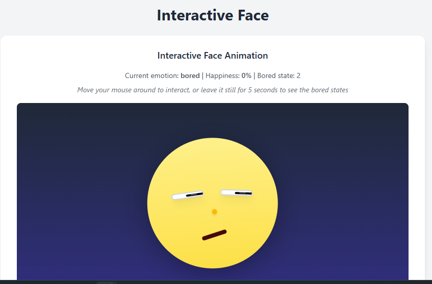

# Interactive face animation Tracker




A playful and interactive face component built with **React** that tracks mouse movement and displays various emotions—**happy**, **surprised**, **bored**, and **neutral**—based on proximity and user interaction.

 <!-- You can replace or remove this line if no demo gif -->

---

## ✨ Features

* 👀 Eyes follow the cursor around the screen.
* 😲 Surprised when you return after a short period of inactivity.
* 🙂 Gets **happier** the closer your mouse is to the face.
* 😐 Returns to **neutral** if interaction reduces.
* 😴 Shows **boredom** after long inactivity.
* 💗 Dynamic facial animations and transitions using CSS + JavaScript.

---

## 📦 Technologies Used

* [React](https://reactjs.org/)
* [Tailwind CSS](https://tailwindcss.com/) for utility-first styling
* HTML5/CSS3
* JavaScript (`useState`, `useEffect`, `useRef`, and DOM APIs)

---

## 🚀 Getting Started

### Prerequisites

Ensure you have **Node.js** and **npm** (or **yarn**) installed:

```bash
node -v
npm -v
```

### Installation

1. **Clone the repo**

```bash
git clone https://github.com/your-username/face-emotion-tracker.git
cd face-emotion-tracker
```

2. **Install dependencies**

```bash
npm install
# or
yarn install
```

3. **Run the app**

```bash
npm start
# or
yarn start
```

Visit `http://localhost:3000` in your browser.

---

## 🧠 How It Works

* Mouse movement is tracked via `window.addEventListener('mousemove')`.
* A central reference point on the face is used to calculate proximity.
* **Happiness** increases with proximity and changes facial features (mouth curve, blush, nose bounce).
* Inactivity timers switch emotion to **bored** or **surprised**.
* Dynamic styling updates the pupil size, eye movement, mouth shape, blush opacity, and more.

---


## 🛠 Customization

You can tweak the emotional thresholds, animation speeds, and eye/mouth sizes directly inside the `FaceFollowingMouse` component logic.

Example:

```js
if (happinessLevel > 0.6) {
  setEmotion('happy');
}
```

---


## 📄 License

MIT License. Feel free to use, modify, and share!

---

## 💡 Inspiration

This project is inspired from a human robot interaction course I took earlier at Carnegie Mellon University.
Let me know if this work ever crosses into the uncanny valley. 

I made this project as a fun experiment to see if I could make some kind of virtual thing that provokes emotion. Also beacuse I thought it would be cool.

